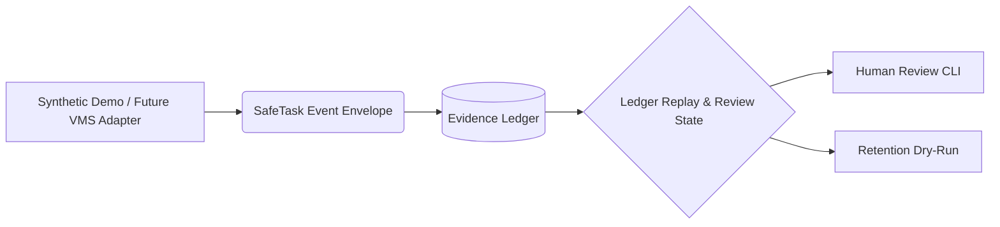

# SafeTask-AI

SafeTask-AI is a private, local-first household safety workbench for human-reviewed event records, notes, retention decisions, and tamper-evident evidence logs.

It is not a surveillance platform, law-enforcement tool, biometric identification system, public monitoring service, or automated escalation system.

## Project Status: Prototype
**WARNING**: SafeTask-AI is a research prototype. It is **not** production security software. It does not provide real-time alerting, physical security guarantees, or emergency dispatch capabilities. Do not rely on it for life safety or property protection.

## Safety and Privacy Boundaries

SafeTask operates under a strict set of ethical and functional boundaries:
- **No ALPR (Automated License Plate Recognition)**
- **No face recognition**
- **No suspicious-person detection**
- **No video tracking**
- **No law-enforcement automation**
- **No emergency automation**
- **No biometrics**
- **No weapon detection**
- **No public surveillance deployment**
- **No cloud dependency**
- **No deletion execution** (Dry-run evaluation only)

## Current Implemented Capabilities
- **Event Schema**: A rigidly defined standard for generic event envelopes (`safetask.events`).
- **Evidence Ledger**: An append-only JSONL data store to securely record events and human actions (`safetask.ledger`).
- **Ledger Replay and Review State**: Reconstruction of an event's active state based on ledger history.
- **Ledger Integrity Hash Chain**: Deterministic verification of ledger mutations to prevent silent tampering.
- **Retention Sweeper (Dry-Run)**: Evaluates retention eligibility for stored events according to retention policy rules, without executing destruction of files.
- **Human Review CLI**: A command-line tool for local operators to inspect states, add notes, update policies, and perform dry-runs.
- **Privacy-Preserving Export Pipeline**: Static image redaction prototype to ensure hazards can be exported while obscuring private details.

## Current Non-Capabilities
- Does not ingest directly from cameras (no direct RTSP, ONVIF, or vendor API integrations).
- Does not execute physical file deletions.
- No Graphical User Interface (GUI), TUI, web server, or dashboards.
- No network broadcasting or alerting channels.

## Architecture Summary
The system expects data to arrive via an upstream local VMS boundary.



SafeTask itself purely manages the post-VMS workflow—verifying evidence validity, accepting human operator reviews, maintaining an audit-ready hash chain, and determining lifecycle expiration.

## Current Status
SafeTask has successfully completed its core proof-of-concept phase. The foundational Event, Ledger, and Retention rules are established, and the Human Review CLI provides a stable interaction layer. SafeTask is now stabilizing its current non-destructive capabilities before expanding adapter boundaries.
## Quickstart

### Verification
Run the core test suite to ensure the baseline dependencies work correctly:
```powershell
python -m unittest discover tests
```

### CLI
Interact with an existing local ledger:

1. **Verify Integrity**:
```powershell
python -m safetask.cli verify-ledger --ledger .safetask/evidence.jsonl
```

2. **Check Review State**:
```powershell
python -m safetask.cli review-state --ledger .safetask/evidence.jsonl --event-id <EVENT_ID>
```

For more details, see the [Operator Quickstart](docs/operator_quickstart.md).
