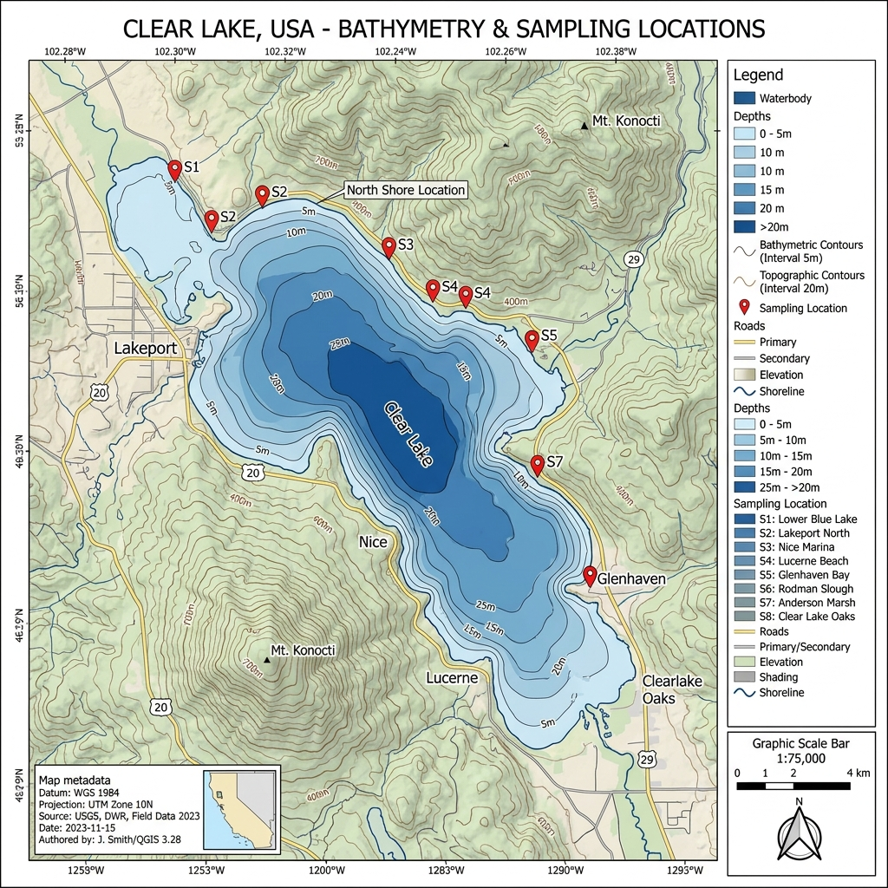

# FieldAware Evidence Package

**Date:** 2026-06-02 06:45:13 UTC
**Site ID:** Clear Lake

---

## 1. Map Context

*Center Coordinates:* 39.0, -122.8
*Generated from Recipe:* clear_lake_context

## 2. Field Notes

- *No field notes provided.*

## 3. Review & Limitations
**Decision State:** ALLOW

*No boundary rules triggered. Routine field operation.*

---
*Generated by FieldAware Export Engine*
*Manifest SHA256: PENDING*