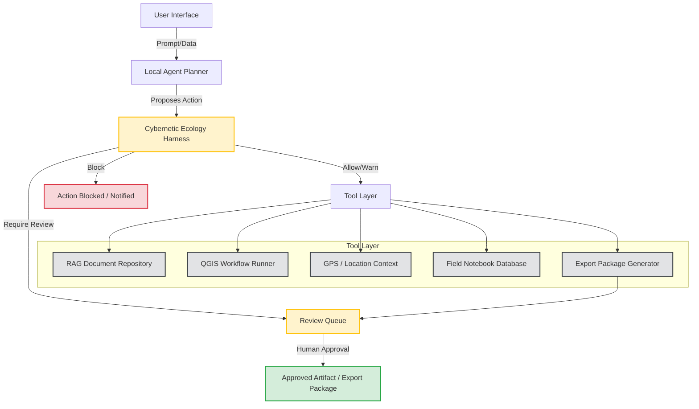

# System Architecture

The FieldAware (Cybernetic Ecology Field Workbench) system relies on a modular, local-first architecture to govern fieldwork operations safely.

## Architecture Diagram

```mermaid
graph TD
    UI[User Interface] -->|Prompt/Data| Planner[Local Agent Planner]
    
    Planner -->|Proposes Action| Harness[Cybernetic Ecology Harness]
    
    Harness -->|Allow/Warn| ToolLayer[Tool Layer]
    Harness -->|Require Review| Review[Review Queue]
    Harness -->|Block| Blocked[Action Blocked / Notified]
    
    subgraph Tool Layer
        RAG[RAG Document Repository]
        QGIS[QGIS Workflow Runner]
        GPS[GPS / Location Context]
        FieldNote[Field Notebook Database]
        Export[Export Package Generator]
    end
    
    ToolLayer --> RAG
    ToolLayer --> QGIS
    ToolLayer --> GPS
    ToolLayer --> FieldNote
    ToolLayer --> Export
    
    Export --> Review
    
    Review -->|Human Approval| Output[Approved Artifact / Export Package]
    
    %% Styling
    classDef safe fill:#d4edda,stroke:#28a745,stroke-width:2px;
    classDef review fill:#fff3cd,stroke:#ffc107,stroke-width:2px;
    classDef block fill:#f8d7da,stroke:#dc3545,stroke-width:2px;
    classDef module fill:#e2e3e5,stroke:#383d41,stroke-width:2px;
    
    class Harness review;
    class Review review;
    class Blocked block;
    class Output safe;
    class RAG,QGIS,GPS,FieldNote,Export module;
```
