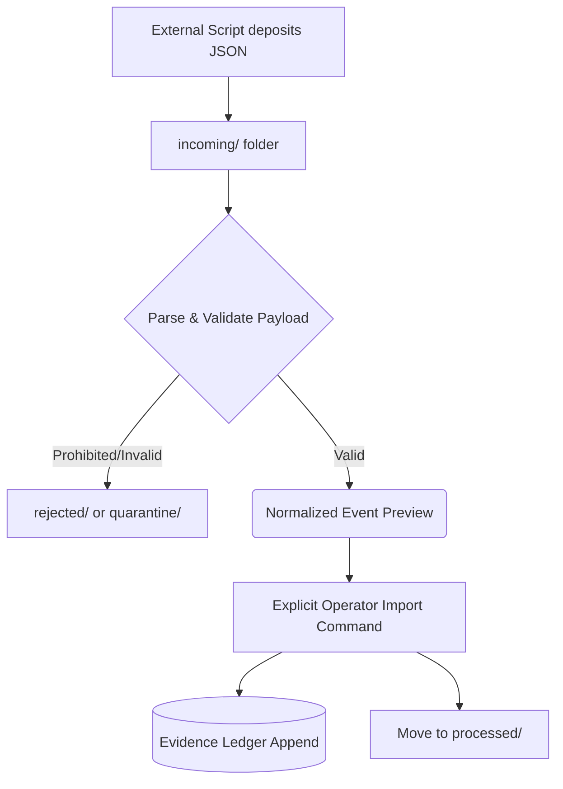

# Drop-Folder Adapter Design

The Drop-Folder Adapter will serve as the first concrete upstream boundary implementation for SafeTask. Instead of directly integrating with complex VMS APIs (like Frigate or ZoneMinder) which could blur ethical boundaries, this design enforces a strict "airlock." External systems or scripts must deposit normalized JSON files into a local folder, where SafeTask can safely ingest them on its own terms.

## Proposed Folder Layout

SafeTask will expect a structured directory for managing the lifecycle of incoming adapter payloads:

```text
.safetask/drop_folder/
├── incoming/    # New payloads deposited by external scripts
├── accepted/    # Payloads successfully validated and normalized (transient)
├── processed/   # Payloads explicitly appended to the Evidence Ledger
├── rejected/    # Payloads that failed structural or capability validation
└── quarantine/  # Payloads with potentially unsafe claims or unhandled errors
```

## Future Processing Flow

The future drop-folder processing pipeline will execute as follows:
1. **Discover**: A script discovers new `.json` files in the `incoming/` directory.
2. **Parse**: The file is loaded as JSON.
3. **Validate**: The payload is passed through the existing pure-Python `safetask.adapters.AdapterPayload` validator.
4. **Reject Prohibited Capabilities**: The firewall actively denies payloads claiming capabilities like face recognition or cloud processing.
5. **Normalize to Event**: The validated payload is converted into the SafeTask `Event` schema.
6. **Preview/Dry-Run**: The normalized event is previewed (similar to the current `adapter-dry-run` CLI command).
7. **Explicit Import**: Only upon explicit operator command (or a future intentional automated step) is an `event_created` action appended to the Evidence Ledger, moving the payload to `processed/`.

## Failure Behavior

To maintain strict determinism and safety:
- **Validation Failures**: Any invalid JSON or failure to meet the schema immediately routes the file to the `rejected/` folder (or `quarantine/` if deeply malformed).
- **Prohibited Capabilities**: Payloads containing disallowed capability flags are aggressively moved to `rejected/`.
- **Duplicate Handling**: SafeTask must reject duplicate `source_event_id`s deterministically. If an event ID already exists in the ledger, the incoming file will be flagged and moved to `rejected/`.
- **No Silent Deletion**: SafeTask will never silently delete a payload. All consumed or rejected files must be moved to their respective lifecycle directories for auditing.

## Explicit Non-Goals

To maintain the local-first household safety workbench identity, this design explicitly excludes:
- No live camera feed streaming or RTSP consumption.
- No direct VMS network integrations (e.g., polling Frigate APIs).
- No background service/watcher implemented in this phase.
- No automated import (ingestion must be triggered explicitly for now).
- No file deletion (only movement to processed/rejected folders).
- No ingestion of biometric or ALPR data.

## Architecture Pipeline



## Payload Shape Reference

External systems depositing files into `incoming/` must adhere to the contract established in [Adapter Contract](adapter_contract.md). A compliant synthetic example is provided at `examples/adapter_payload_demo.json`.
