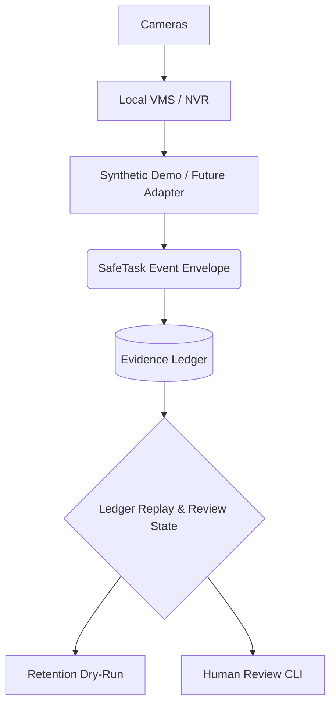

# Local VMS Architecture Boundary

SafeTask is designed to sit **above** the local Video Management System (VMS) or Network Video Recorder (NVR) layer. SafeTask does not directly connect to cameras or stream RTSP feeds; instead, it relies on a local VMS to handle raw video ingestion, recording, and basic event detection.

SafeTask focuses on the **evidence ledger**: human review, notes, tags, retention policies, and situational awareness.

## Architecture Diagram

## Possible Future VMS Substrates

| Option                            | Best Use | Notes |
| --------------------------------- | ---: | --- |
| **Local Open Source VMS** | Best likely future fit | Local AI object detection, MQTT, Home Assistant ecosystem, hardware accelerator support. |
| **Traditional CCTV/NVR**  | Mature CCTV | Full-featured traditional systems, but should be kept private/VPN-only if used. |

## Adapter Contract: Future Event Ingestion

To prepare for future VMS integration, SafeTask requires adapters to meet a strict contract. For full details on adapter schemas, prohibited capability flags, and mapping logic, refer to the [Adapter Contract](adapter_contract.md).
