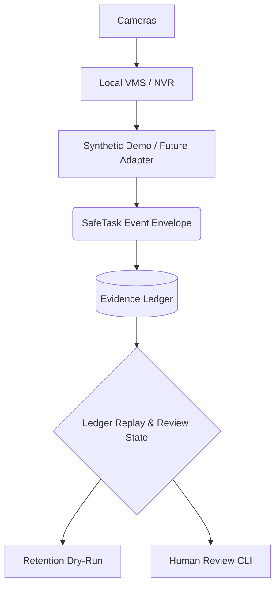

# Local VMS Architecture Boundary

SafeTask is designed to sit **above** the local Video Management System (VMS) or Network Video Recorder (NVR) layer. SafeTask does not directly connect to cameras or stream RTSP feeds; instead, it relies on a local VMS to handle raw video ingestion, recording, and basic event detection.

SafeTask focuses on the **evidence ledger**: human review, notes, tags, retention policies, and situational awareness.

## Architecture Diagram

## Possible Future VMS Substrates

| Option                            | Best Use | Notes |
| --------------------------------- | ---: | --- |
| **Frigate**                       | Best likely future fit | Local AI object detection, MQTT, Home Assistant ecosystem, hardware accelerator support. |
| **ZoneMinder**                    | Mature, traditional CCTV/NVR | Full-featured open-source surveillance system, but should be kept private/VPN-only if used. |
| **Shinobi**                       | Lightweight/dev-friendly NVR | Open-source, Node.js-based, performance-oriented NVR. |
| **Synology Surveillance Station** | NAS-native option | Less open, but practical if you use a Synology NAS. |

**Note on VicoHome / VisionWell:**
Existing VicoHome cameras may or may not be usable locally. Treat them as an uncertain future compatibility investigation, not as a current dependency. We will not attempt to bypass vendor camera restrictions or reverse engineer cloud services.

## Adapter Contract: Future Event Ingestion

To prepare for future VMS integration, SafeTask requires adapters to meet a strict contract. For full details on adapter schemas, prohibited capability flags, and mapping logic, refer to the [Adapter Contract](adapter_contract.md).
